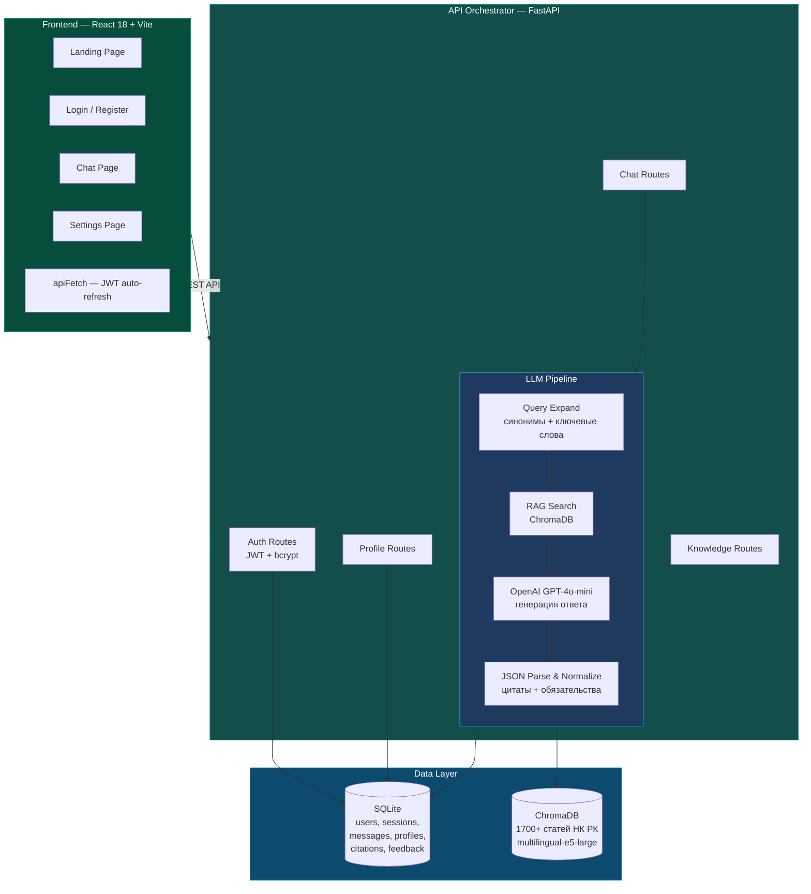
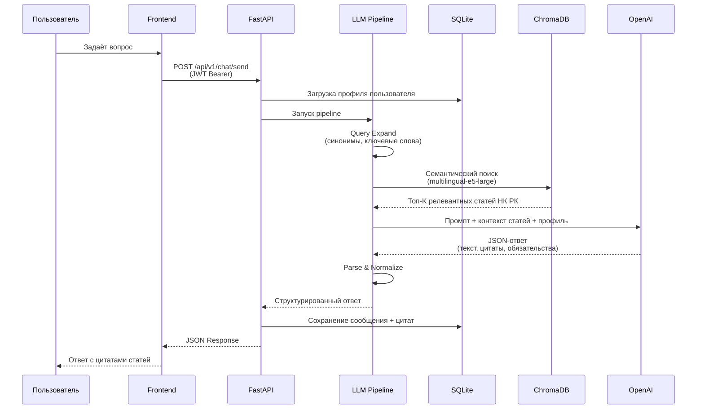
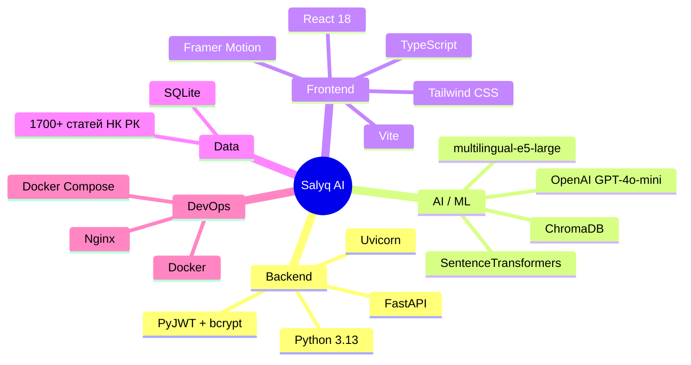

# Salyq AI — Архитектура системы

## Общая схема

```mermaid
graph TB
    subgraph Frontend["Frontend — React 18 + Vite"]
        LP[Landing Page]
        AUTH[Login / Register]
        CHAT[Chat Page]
        SETTINGS[Settings Page]
        API_CLIENT[apiFetch — JWT auto-refresh]
    end

    subgraph Backend["API Orchestrator — FastAPI"]
        direction TB
        AUTH_R[Auth Routes<br/>JWT + bcrypt]
        CHAT_R[Chat Routes]
        PROFILE_R[Profile Routes]
        KNOWLEDGE_R[Knowledge Routes]

        subgraph LLM_PIPELINE["LLM Pipeline"]
            direction TB
            QE[Query Expand<br/>синонимы + ключевые слова]
            RAG[RAG Search<br/>ChromaDB]
            GPT[OpenAI GPT-4o-mini<br/>генерация ответа]
            PARSE[JSON Parse & Normalize<br/>цитаты + обязательства]
            QE --> RAG --> GPT --> PARSE
        end
    end

    subgraph Data["Data Layer"]
        direction LR
        SQLITE[(SQLite<br/>users, sessions,<br/>messages, profiles,<br/>citations, feedback)]
        CHROMA[(ChromaDB<br/>1700+ статей НК РК<br/>multilingual-e5-large)]
    end

    Frontend -->|REST API| Backend
    AUTH_R --> SQLITE
    CHAT_R --> LLM_PIPELINE
    PROFILE_R --> SQLITE
    LLM_PIPELINE --> SQLITE
    LLM_PIPELINE --> CHROMA

    style Frontend fill:#064e3b,stroke:#059669,color:#fff
    style Backend fill:#134e4a,stroke:#0d9488,color:#fff
    style Data fill:#0c4a6e,stroke:#0ea5e9,color:#fff
    style LLM_PIPELINE fill:#1e3a5f,stroke:#38bdf8,color:#fff
```

## Поток обработки запроса

```mermaid
sequenceDiagram
    participant U as Пользователь
    participant F as Frontend
    participant API as FastAPI
    participant LLM as LLM Pipeline
    participant DB as SQLite
    participant VDB as ChromaDB
    participant GPT as OpenAI

    U->>F: Задаёт вопрос
    F->>API: POST /api/v1/chat/send<br/>(JWT Bearer)
    API->>DB: Загрузка профиля пользователя
    API->>LLM: Запуск pipeline

    LLM->>LLM: Query Expand<br/>(синонимы, ключевые слова)
    LLM->>VDB: Семантический поиск<br/>(multilingual-e5-large)
    VDB-->>LLM: Топ-K релевантных статей НК РК

    LLM->>GPT: Промпт + контекст статей + профиль
    GPT-->>LLM: JSON-ответ<br/>(текст, цитаты, обязательства)

    LLM->>LLM: Parse & Normalize
    LLM-->>API: Структурированный ответ
    API->>DB: Сохранение сообщения + цитат
    API-->>F: JSON Response
    F-->>U: Ответ с цитатами статей
```

## Стек технологий

```mermaid
mindmap
  root((Salyq AI))
    Backend
      FastAPI
      Python 3.13
      Uvicorn
      PyJWT + bcrypt
    AI / ML
      OpenAI GPT-4o-mini
      ChromaDB
      SentenceTransformers
      multilingual-e5-large
    Frontend
      React 18
      TypeScript
      Vite
      Tailwind CSS
      Framer Motion
    Data
      SQLite
      1700+ статей НК РК
    DevOps
      Docker
      Docker Compose
      Nginx
```
